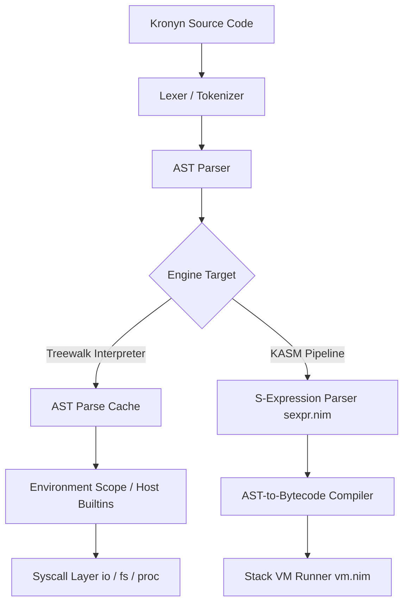

# Kronyn Architecture & Technical Specification
*A Minimal, Extensible, Intent-Driven Programming Language and System Runtime*

---

## 1. Executive Summary & Vision

**Kronyn** is a lightweight, extensible interpreted programming language written in **Nim**. Designed around the principle of *"everything is a string"*, Kronyn bridges the flexibility of dynamic command languages (like Tcl) with the structured intent execution model of the **MORRIS standards**.

### Key Architectural Highlights
- **Language-Based OS Vision**: Collapses the boundary between application scripting and operating system shell capabilities.
- **Dual Engine Design**: High-performance Treewalk Interpreter with AST Caching (Active) transitioning to a Stack-based Bytecode Virtual Machine with S-Expression Assembly IR (**KASM**).
- **Embedded Kernel (`staticRead`)**: Compile-time embedding of the standard library (`stdlib.kr`), achieving instant startup with zero runtime disk read I/O.
- **Zero-Overhead Option Monad**: Native error handling and null-safety built into standard string representations using hidden byte markers.

---

## 2. Language Paradigms & Syntax

### 2.1 String Representations
In Kronyn, all values are fundamentally strings. To avoid un-structured "string soup", Kronyn enforces three distinct syntactic forms for strings:

| Syntax | Category | Description & Usage |
| :--- | :--- | :--- |
| `"..."` | **Literal String** | Direct character sequence. Escapes like `\n` and `\t` are evaluated. |
| `[...]` | **Inferred Expression** | Sub-expression evaluated immediately in the current scope. |
| `{...}` | **Code Block** | Deferred evaluation block (used for function bodies, loops, and callbacks). |

### 2.2 Intents vs. Dot-Functions

Kronyn distinguishes between top-level commands (**Intents**) and method-style calls (**Dot Functions**):

1. **Custom Intents (`proc`)**:
   Top-level command execution, taking positional arguments.
   ```kronyn
   define greet proc(name) {
       writeln ["Hello " .. $name]
   }
   greet "World"
   ```

2. **Dot-Function Chaining (`fn`)**:
   Receives the caller on `self` and enables fluid method chaining.
   ```kronyn
   define double fn(self) {
       return [$self * 2]
   }
   writeln 5.double().double() # 20
   ```

---

## 3. Technical Implementation & Runtime Design



### 3.1 Embedded Kernel (`staticRead`)
To eliminate filesystem dependency at boot, `stdlib.kr` is compiled directly into the executable binary:

```nim
const STDLIB = staticRead("./stdlib.kr")

proc newInterpreter*(): Env =
  let env = newEnv()
  env.initKernel()
  discard env.eval(parse(tokenize(STDLIB)))
  env
```

### 3.2 AST Parse Caching
To minimize overhead during loops and recursive calls, Kronyn maintains AST caches (`bodyCache` and `subCache`). Re-evaluating a block bypasses tokenization and parsing entirely:

```nim
proc evalBody*(env: Env, src: string): Value =
  if src notin bodyCache:
    inc bodyCacheMiss
    bodyCache[src] = parse(tokenize(src))
  else:
    inc bodyCacheHits
  env.eval(bodyCache[src])
```

### 3.3 Option Monad (Null Safety without Types)
Kronyn implements an Option pattern using ASCII control character markers (`\x02` for `some`, `\x03` for `none`):

```nim
const
  SOME_PREFIX = "\x02"
  NONE_VAL = "\x03"

proc mkSome(v: Value): Value = SOME_PREFIX & v
proc mkNone(): Value = NONE_VAL
```

Built-in Dot Functions interact with Option values:
- `.some?()`: Returns `1` if value contains a payload, `0` otherwise.
- `.none?()`: Returns `1` if empty, `0` otherwise.
- `.unwrap()`: Extracts payload from `some`.
- `.unwrapOr(default)`: Returns payload or fallback value.

### 3.4 System Call Layer (`syscall`)
System interactions are routed through explicit namespaces:
- `syscall io.output` / `io.outputln`: Standard output.
- `syscall io.input`: Standard input.
- `syscall fs.read` / `fs.write`: File operations (returns `Option` values).
- `syscall proc.exit`: Process termination.

---

## 4. Practical Code Examples

### 4.1 Recursion & Math (Fibonacci)
```kronyn
define fib fn(self) {
    if [$self == 0] {return 0} 
    elif [$self == 1] {return 1} 
    else {return [[$self - 1].fib() + [$self - 2].fib()]}
}

writeln 0.fib()  # 0
writeln 5.fib()  # 5
writeln 10.fib() # 55
```

### 4.2 String Processing Pipeline & Palindrome Check
```kronyn
define reverse fn(self) {
    set result ""
    set i [$self.len() - 1]
    loop {
        if [$i < 0] {break}
        set result [$result .. $self.index($i)]
        set i [$i - 1]
    }
    return $result
}

define isPalindrome fn(self) {
    if [$self.reverse() == $self] {return "true"} else {return "false"}
}

writeln "racecar".isPalindrome() # true
writeln " Kronyn ".trim().toUpper().concat(" Rocks") # KRONYN Rocks
```

### 4.3 Safe File Reading with Option Monad
```kronyn
set contents [syscall fs.read "config.txt"]
if [$contents.some?()] {
    writeln ["File Contents: " .. $contents.unwrap()]
} else {
    writeln "Config file missing!"
}
```

---

## 5. Architecture Roadmap: KASM & Bytecode VM

While the Treewalk Interpreter handles active execution, Phase 3 introduces **KASM (Kronyn Assembly)** and a stack-based **Bytecode VM**.

### 5.1 KASM S-Expression Representation
KASM provides a clean, inspectable S-expression Intermediate Representation (IR):

```lisp
(fn "main"
    (store-global "x" "0")
    (loop
        (store-global "x" (add (load-global "x") "1"))
        (if (eq (load-global "x") "5") (break)))
    (call "writeln" (load-global "x")))

(call "main")
```

### 5.2 VM Instruction Opcodes (`opcodes.nim`)
The Bytecode engine compiles ASTs into linearized instruction chunks:

```nim
type
  OpCode* = enum
    OP_PUSH, OP_POP, OP_DUP, OP_LOAD, OP_STORE,
    OP_ADD, OP_SUB, OP_MUL, OP_DIV, OP_CONCAT,
    OP_EQ, OP_NEQ, OP_LT, OP_GT, OP_LTE, OP_GTE,
    OP_CALL, OP_CALL_METHOD, OP_RETURN,
    OP_JUMP, OP_JUMP_IF, OP_JUMP_UNLESS, OP_LOOP_START, OP_BREAK,
    OP_SYSCALL, OP_EVOLVE, OP_HALT
```

---

## 6. Summary Checklist for Presentation

| Aspect | Feature | Status |
| :--- | :--- | :--- |
| **Parsing** | Tokenizer & Recursive Descent Parser | ✅ Production Ready |
| **Stdlib** | Baked-in Kernel (`staticRead`) | ✅ Production Ready |
| **Execution** | AST Treewalk Interpreter | ✅ Production Ready |
| **Optimization** | Body & Sub-expression Caching | ✅ Production Ready |
| **Safety** | String-tagged Option Monad | ✅ Production Ready |
| **IR Layer** | S-Expression KASM Parser | 🚧 In Progress |
| **VM Backend** | Stack-based Bytecode Executor | 🚧 In Progress |
